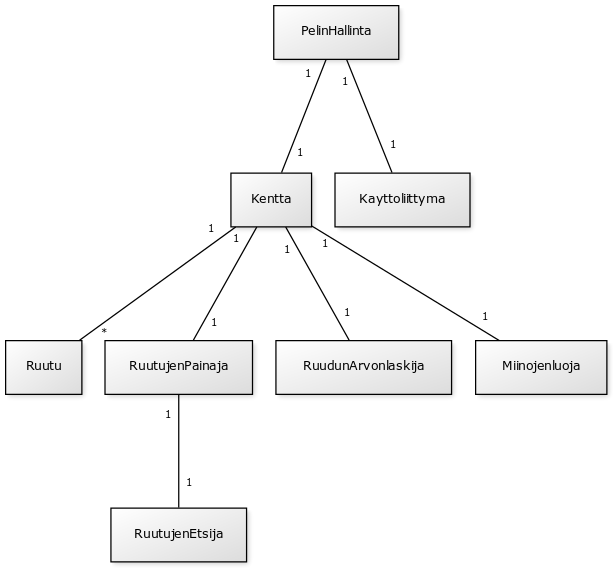

**Aihe:** Miinaharava peli. Perus miinaharavan säännöt eli miinoja piilossa ja numeroita ruuduissa kertomassa miinojen määrän lähellä ja peli loppuu kun osuu miinaan tai kun kaikki ruudut missä ei ole miinaa on paljastettu. Mahdollisesti kentän koon ja miinojen määrän vaihto asetus. 

**Käyttäjät:** Pelaaja

**Käyttäjien toiminnot:**
- ruutujen paljastaminen
- voi vaihtaa kentän kokoa/miinojen määrää ja aloittaa uuden pelin

**Käyttöohjeet:**

Paina ruutuja ja yritä olla osumatta miinoihin. Ruudussa oleva luku kertoo vieressä olevien miinojen määrän. Lukujen avulla tulisi päätellä missä on miinoja ja missä ei. Kun olet paljastanut kaikki ruudut missä ei ole miinoja, voitat pelin. Jos osut miinaan häviät. Uuden pelin voi aloittaa syöttämällä sivunpituuden (alle 50) ja miinojenmäärän (max sivunpituus*sivupituus), minkä jälkeen painetaan Uusi peli painiketta. Pelissä on myös sekunttikello, joka kertoo kuinka nopeasti voitit/hävisit pelin.

**Ohjelmanrakenteen kuvaus:**

PelinHallinta luokka on vastuussa pelin alustamisessa ja uuden pelin aloittamisessa.

Luokka Kentta luo tyhjän pelialustan (ei miinoja). Pelialusta on Ruutu olioista koostuva array Ruutu[][]. Jokaisella Ruutu oliolla on oma JButton, joka mahdollistaa ruutujen painamisen. Kentan luomisessa käytetään apuna luokkia RuudunArvonlaskija ja Miinojenluoja.

RuutujenPainaja luokkaa kutsutaan kun TapahtumaKuuntelija, joka liittyy JButtoneihin, huomaa painikkeen painalluksen. RuutujenPainaja ja RuutujenEtsijä hoitavat logiikan miten pelialustan ruutuja paljastetaan.

**Kaavioita:**

