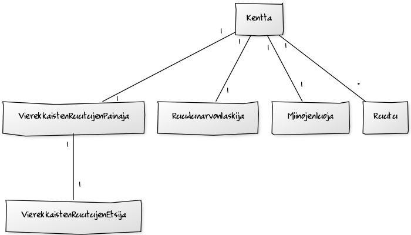
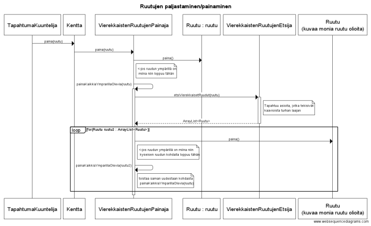

**Aihe:** Miinaharava peli. Perus miinaharavan säännöt eli miinoja piilossa ja numeroita ruuduissa kertomassa miinojen määrän lähellä ja peli loppuu kun osuu miinaan tai kun kaikki ruudut missä ei ole miinaa on paljastettu. Mahdollisesti kentän koon ja miinojen määrän vaihto asetus. 

**Käyttäjät:** Pelaaja

**Käyttäjien toiminnot:**
- ruutujen paljastaminen
- lippujen lisääminen paljastamattomiin ruutuihin
- mahdollisesti kysymys merkkien lisääminen paljastamattomiin ruutuihin
- voi vaihtaa kentän kokoa/miinojen määrää ja aloittaa uuden pelin

**Kaavioita**

Tällä hetkellä ei ole muita käyttötapauksia(tulee lisää)

