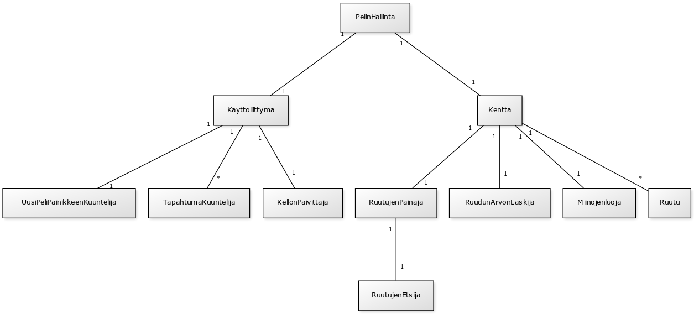
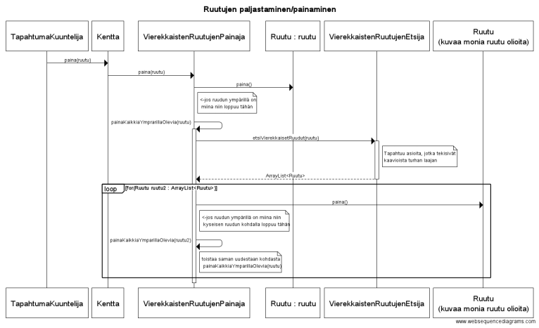
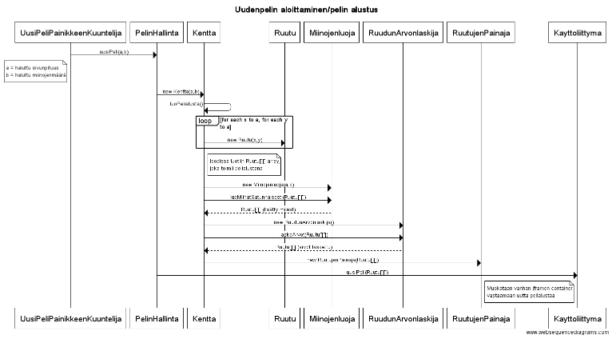

**Aihe:** Miinaharava peli. Perus miinaharavan säännöt eli miinoja piilossa ja numeroita ruuduissa kertomassa miinojen määrän lähellä ja peli loppuu kun osuu miinaan tai kun kaikki ruudut missä ei ole miinaa on paljastettu.

**Käyttäjät:** Pelaaja

**Käyttäjien toiminnot:**
- ruutujen paljastaminen
- voi vaihtaa kentän kokoa/miinojen määrää ja aloittaa uuden pelin

**Ohjelmanrakenteen kuvaus:**

PelinHallinta luokka on vastuussa pelin alustamisessa ja uuden pelin aloittamisessa.

Luokka Kentta luo tyhjän pelialustan (ei miinoja). Pelialusta on Ruutu olioista koostuva array Ruutu[][]. Jokaisella Ruutu oliolla on oma JButton, joka mahdollistaa ruutujen painamisen. Kentan luomisessa käytetään apuna luokkia Miinojenluoja ja RuudunArvonlaskija, jotka nimiensä mukaisesti lisäävät miinat Ruutu olioihin ja laskevat montako miinaa on kunkin ruudun ympärillä.

RuutujenPainaja luokkaa kutsutaan kun TapahtumaKuuntelija, joka liittyy JButtoneihin, huomaa painikkeen painalluksen. RuutujenPainaja ja RuutujenEtsijä hoitavat logiikan miten pelialustan ruutuja paljastetaan.

**Kaavioita:**

(Jotain ei niin olennaisia asioita jätetty pois sekvenssikaavioista, luettavuuden säilyttämiseksi)

