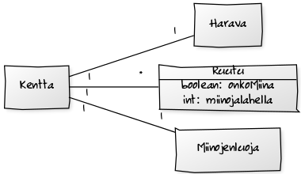

**Aihe:** Miinaharava peli. Perus miinaharavan säännöt eli miinoja piilossa ja numeroita ruuduissa kertomassa miinojen määrän lähellä ja peli loppuu kun osuu miinaan tai kun kaikki ruudut missä ei ole miinaa on paljastettu. Mahdollisesti kentän koon ja miinojen määrän vaihto asetus. 

**Käyttäjät:** Pelaaja

**Käyttäjien toiminnot:**
- miinojen paljastaminen ruuduista
- lippujen lisääminen paljastamattomiin ruutuihin
- mahdollisesti kysymys merkkien lisääminen paljastamattomiin ruutuihin

